## Rainbow-API 项目(Vue项目的后台API接口提供)

### 1.接口定义

- Home页面获取Cover图片
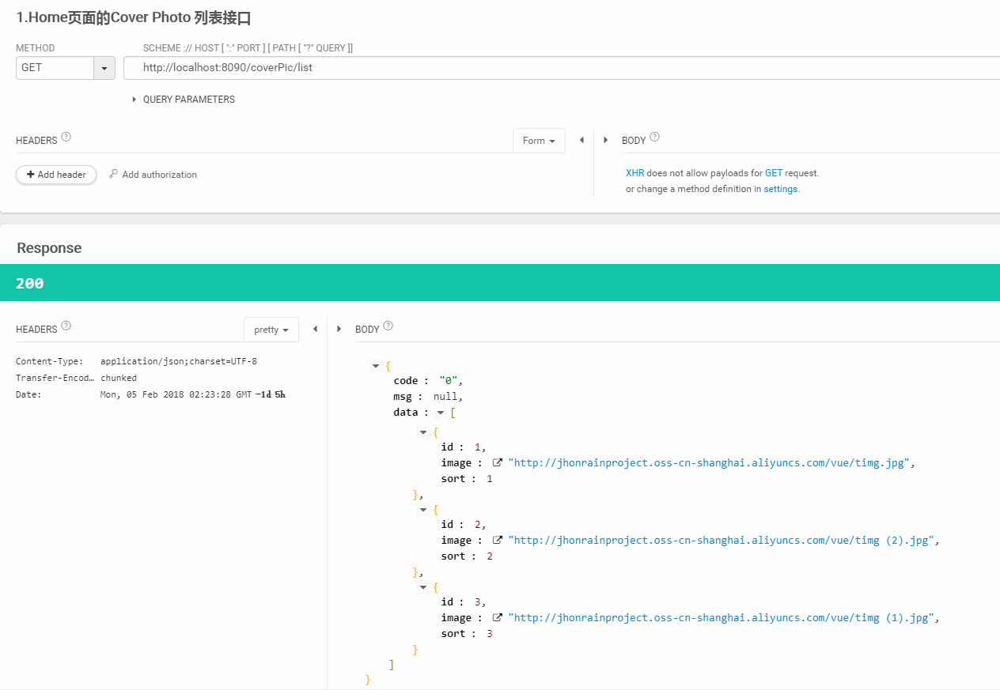

- 获取资讯列表接口
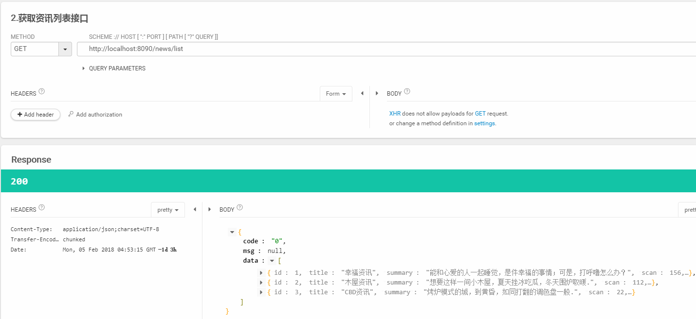

- 获取资讯详情的接口
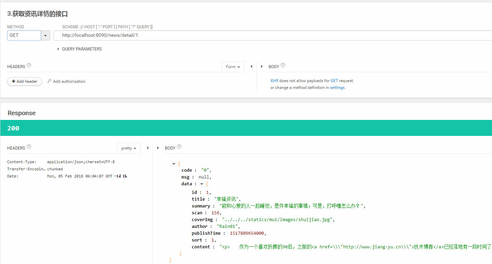

- 新增评论接口
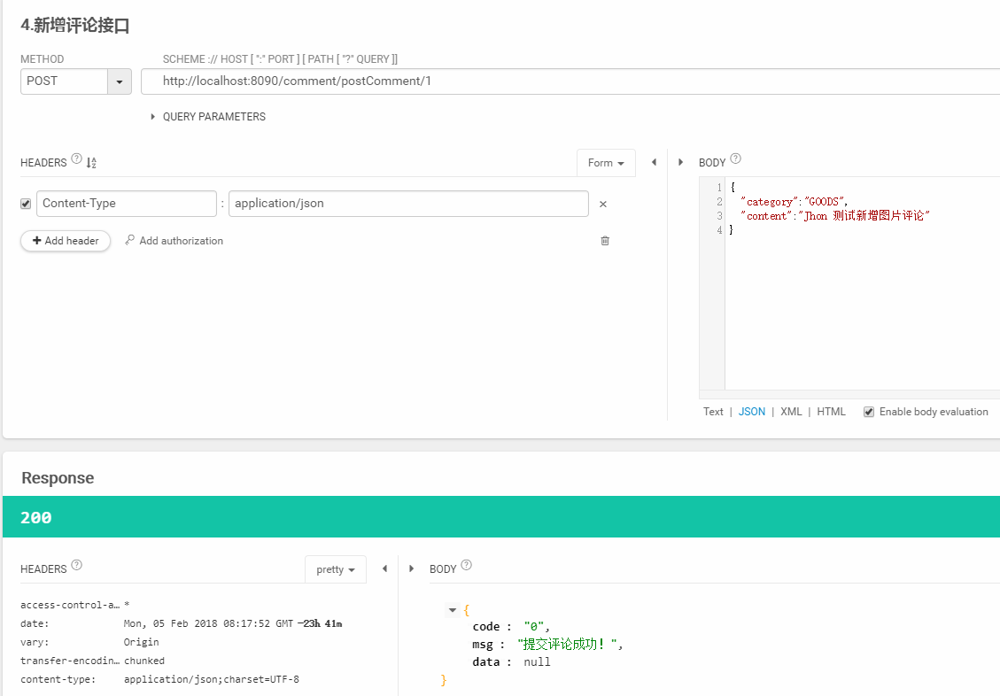

- 获取评论列表接口

- 获取图片类目
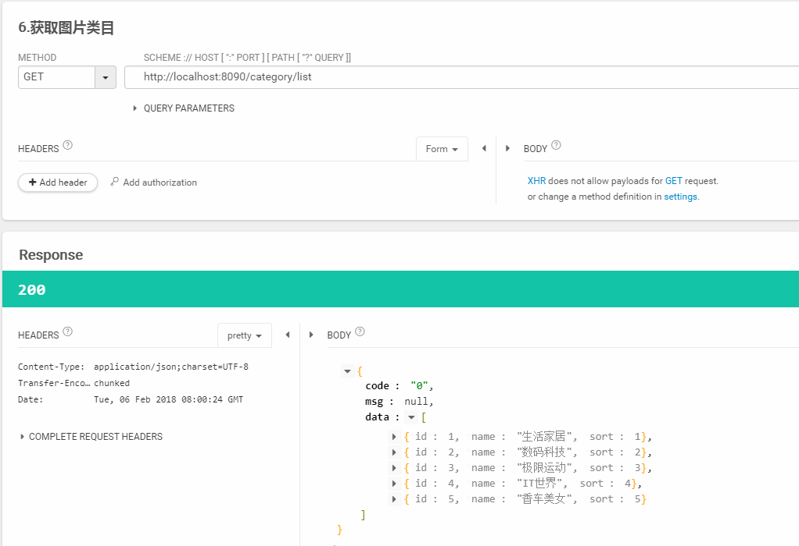

- 获取商品列表
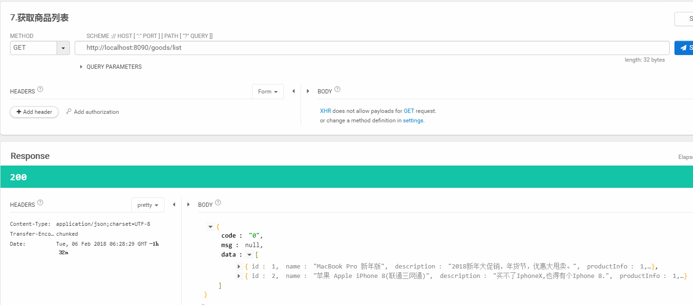

- 批量获取商品的信息
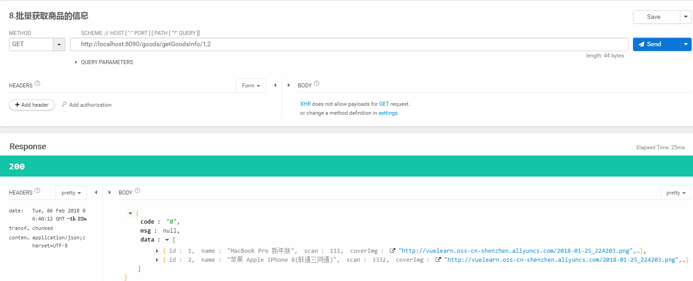

- 获取商品信息(全)
.png)

- 获取商品的描述信息
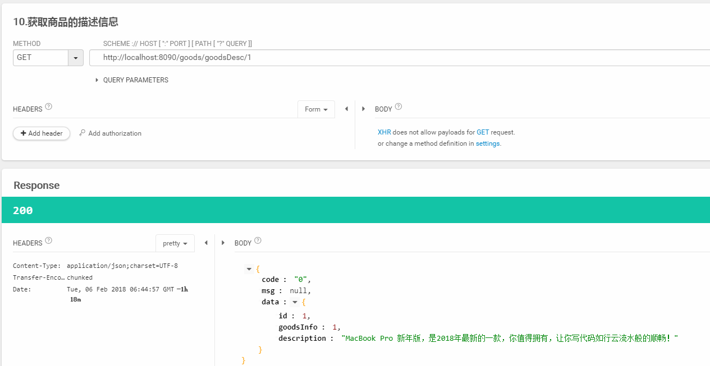

- 获取图片信息的缩略图列表
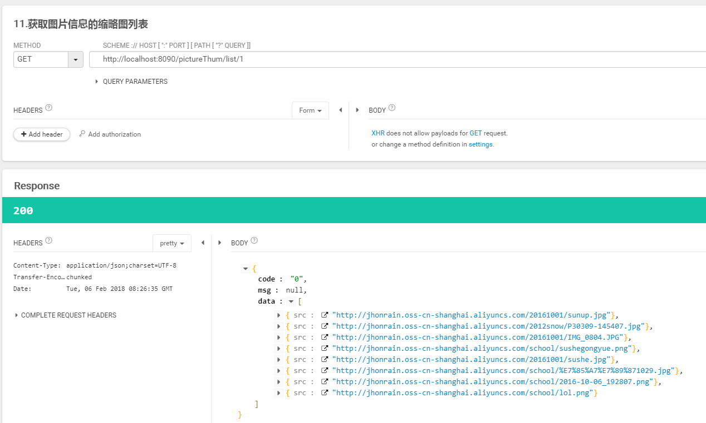

- 获取图片详细信息
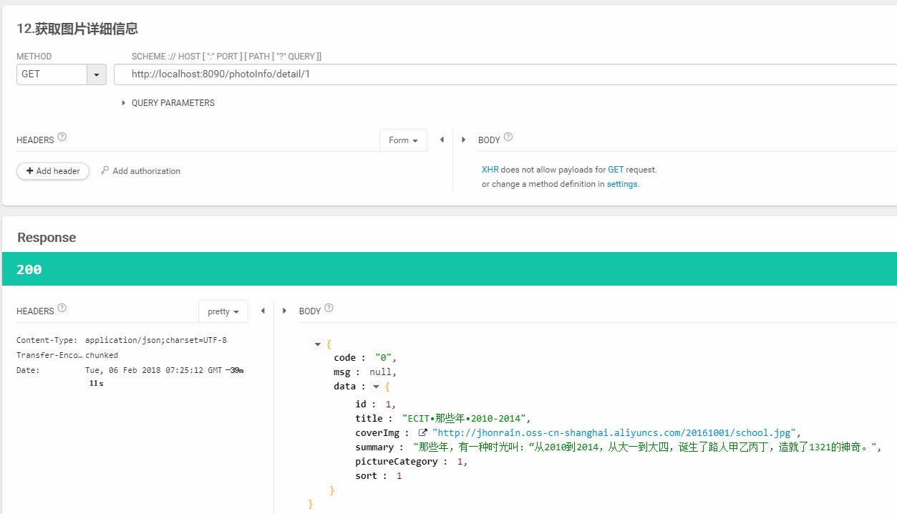

### 2.效果预览

- 前端页面效果预览图01
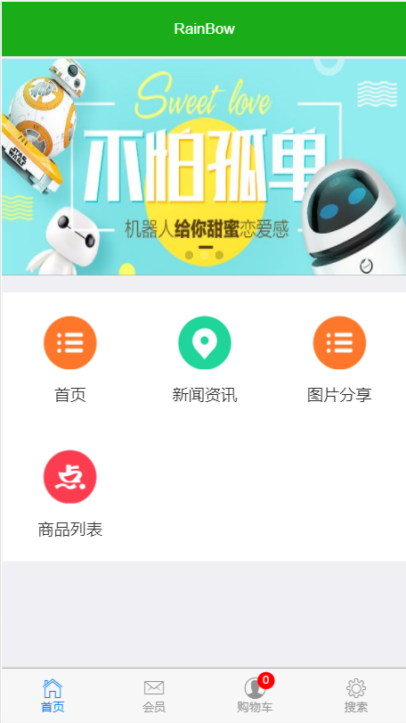

- 前端页面效果预览图02
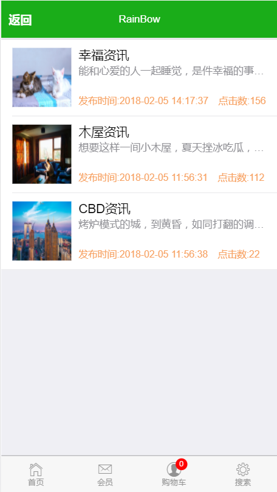

- 前端页面效果预览图03
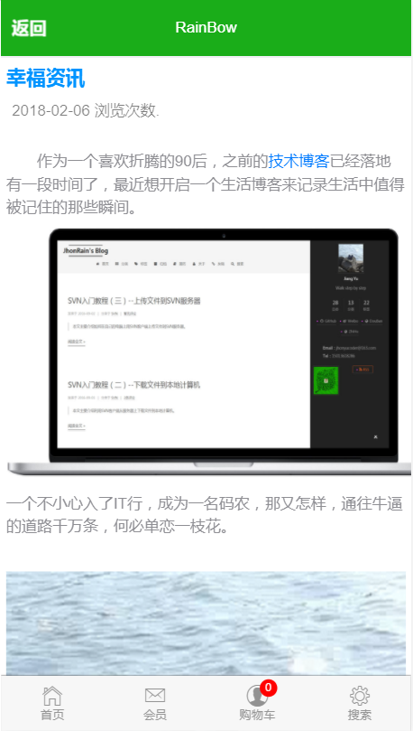

- 前端页面效果预览图04
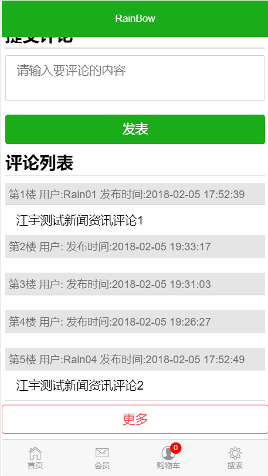

- 前端页面效果预览图05
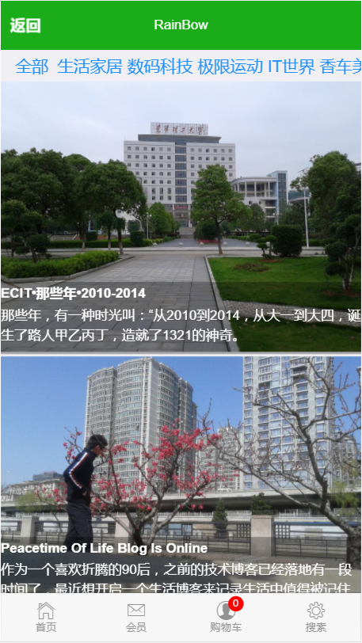

- 前端页面效果预览图06
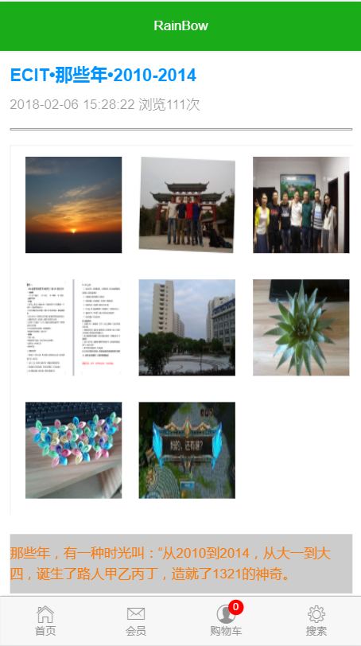

- 前端页面效果预览图07
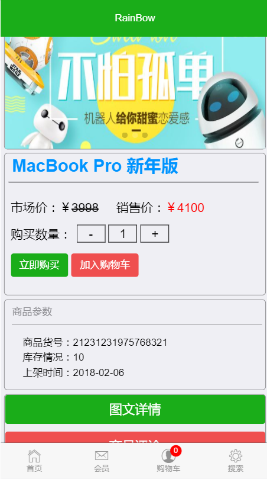

- 前端页面效果预览图08

### 3.Vue项目链接

[查看 Rainbow Vue 项目](https://github.com/YuJhon/Vue-Learning/tree/master/zrainbow)

### 4.API项目技术

- Spring Boot
- Mybatis

### 5.接口风格
- RESTFUL 风格 

### 6.总结
 2018-02-06 (略)

